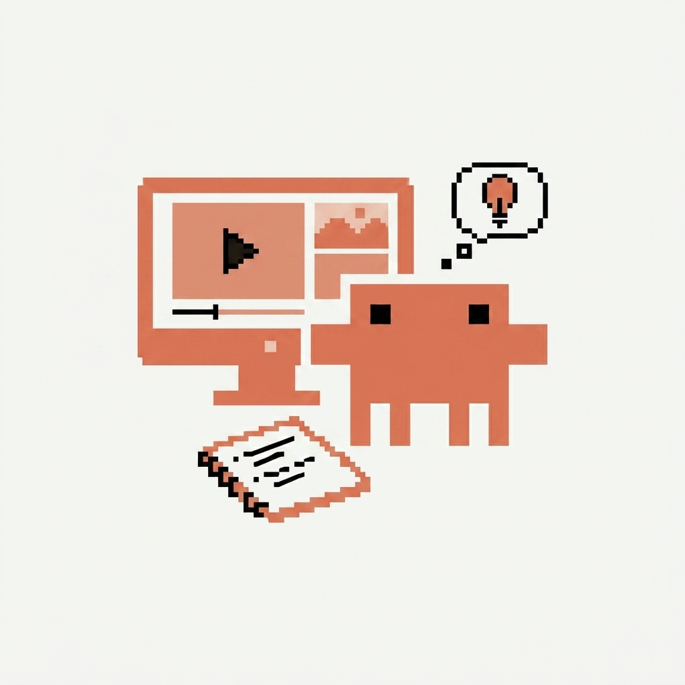

<p align="center">
  
</p>

# video-analyzer — Claude Code plugin

Анализ видео **локально** прямо из Claude Code: записи созвонов с клиентами/коллегами и
демо инструментов/конкурентов. Принимает локальный файл или YouTube-ссылку. Всё считается на
машине — без облака и платных API. **По умолчанию собирает PDF-отчёт**, который можно отправить
коллеге: выводы простым языком, скриншоты рядом с выводами, для созвонов — расшифровка по ролям.

Сделано для продакт-менеджеров (Discovery, разбор клиентских интервью, анализ конкурентов), но
полезно всем, кому нужно быстро понять, что происходит на видео.

## Что умеет

- **Три жанра, три стратегии:**
  - **Созвон / интервью** → транскрипт + **диаризация** (кто что сказал) → продуктовое саммари:
    боли клиента, договорённости, action items, оценка качества интервью.
  - **Демо инструмента / конкурента** → визуальный разбор экранов: фичи, UX-флоу, выводы для продукта.
  - **Гибрид** (созвон с шарингом экрана) → саммари + врезка «что показали на экране».
- **PDF-отчёт по умолчанию** (pandoc + weasyprint): обложка, разбор простым языком, **скриншоты
  встроены рядом с выводом, который подтверждают**, с подписями-связками.
- **Привязка кадров к речи.** Пословный тайминг (`words.json`, источник истины) → для каждого
  кадра собирается его речевой контекст (`frames_context.md`), поэтому скриншоты разбираются
  «в контексте того, что говорилось».
- **Умный отбор кадров (content-aware).** Кадр берётся в СЕРЕДИНЕ показа (чёткий, а не смазанный
  переход); почти-дубли схлопываются перцептив-хэшем; из уменьшенных **контактных листов**
  субагент-скринер отбирает ценные уникальные экраны — так в отчёт попадает основная масса
  полезных интерфейсов, а модель читает в полном разрешении только финалистов (экономно по токенам).
- **Фокус-режим:** разбор конкретного отрезка длинного видео (кадры гуще, транскрипт по окну).
- **Критический разбор** (опционально): на чём стоят заявления, что стоило доспросить / где перехайп.
- **Источники:** локальные видеофайлы и **YouTube-ссылки** (через `yt-dlp`).
- **Локально и приватно:** видео/аудио не покидают машину.

## Как это работает

```
видео/URL ─▶ ingest.sh (yt-dlp / файл)
          ─▶ extract.sh (ffmpeg): кадры в СЕРЕДИНЕ показов (щедро) + audio.wav
          ─▶ transcribe.sh ─▶ diarize_transcribe.py (faster-whisper + pyannote)
                               → audio.srt/.txt/.json + words.json (источник истины)
          ─▶ отбор кадров:  dedup_frames.py (near-identical, CPU)
                          ─▶ contact_sheets.py (montage тамбнейлов)
                          ─▶ субагент-скринер отбирает ценные уникальные экраны
          ─▶ frame_windows.py — речевой контекст кадров
          ─▶ Claude читает финалистов (Read) + транскрипт ─▶ frames_context.md
          ─▶ make_report.sh (pandoc + weasyprint) ─▶ PDF-отчёт
```

Транскрипция — faster-whisper с пословными таймкодами; диаризация — pyannote напрямую; спикеры
назначаются по перекрытию слов с речевыми интервалами. Медленное wav2vec2-выравнивание whisperx
не используется.

## Требования

- **macOS** (тестировалось на Apple Silicon), [Homebrew](https://brew.sh)
- Python 3.9–3.12 (для venv с torch/faster-whisper; Pillow — для контактных листов)
- Зависимости ставит `setup.sh`: `ffmpeg`, `yt-dlp`, `pandoc`, `weasyprint` (brew) +
  `faster-whisper`, `pyannote`, `pillow` (pip в `.venv`)
- Для диаризации — бесплатный токен [HuggingFace](https://huggingface.co/settings/tokens)
  (нужно один раз принять условия моделей `pyannote/speaker-diarization-3.1` и
  `pyannote/segmentation-3.0`). Без токена скилл работает, но без меток говорящих.

## Установка

```bash
# как плагин Claude Code
claude plugin install video-analyzer@Avatechdir/claude-video-analyzer
# либо склонировать и поставить вручную как skill:
# git clone https://github.com/Avatechdir/claude-video-analyzer
# cp -R claude-video-analyzer/skills/video-analyzer ~/.claude/skills/

# затем один раз установить зависимости и токен:
bash ~/.claude/plugins/.../skills/video-analyzer/scripts/setup.sh
# токен диаризации можно ввести/обновить отдельно:
bash .../scripts/set-token.sh
```

## Использование

В Claude Code напиши естественно:

```
посмотри это видео ~/Downloads/созвон.mp4
проанализируй запись созвона ~/Desktop/client-call.mov
разбери этот инструмент конкурента https://youtu.be/...
сделай PDF-отчёт по этому демо https://youtu.be/...
```

Claude сам определит жанр, прогонит пайплайн и соберёт PDF-отчёт (+ краткое саммари в чат).
Для длинного видео предложит разобрать целиком или конкретный отрезок.

## Производительность и выбор модели

Транскрипция идёт на CPU (faster-whisper, ctranslate2 int8). **На Apple Silicon с системным
Python практичной оказалась только модель `small`** — она быстрая (~0.17× реального времени) и
чисто распознаёт русский. Модели крупнее на этом окружении патологически медленные (`medium` ≈ 32×,
`large-v3-turbo` ≈ 4.5× реального времени) — дефолт стоит `small`. Переопределить:
`WHISPER_MODEL=medium` перед вызовом. На машине с GPU/оптимизированным билдом можно смело брать
крупнее. Диаризация (pyannote) на CPU — порядка реального времени.

Отбор кадров устроен так, чтобы экономить токены: перцептив-хэш и контактные листы — это CPU
(бесплатно), субагент-скринер читает уменьшенные превью, а модель читает в полном разрешении
только отобранные финалисты.

## Настройки (env-переменные)

| Переменная | По умолч. | Назначение |
|---|---|---|
| `WHISPER_MODEL` | `small` | модель Whisper (`small`/`medium`/`large-v3`/…) |
| `WHISPER_THREADS` | `4` | число потоков CPU |
| `FRAME_FORMAT` | `jpg` | формат кадров; `png` — для демо/скринкастов (текст UI без потерь) |
| `EXTRACT_MAX` | `300` | щедрый потолок извлечения кадров-кандидатов |
| `MAX_FRAMES` | `80` | финальный бюджет кадров (после дедупа/скринера) |
| `MIN_SEG` | `0.7` | отрезок между склейками короче — переход, пропускаем |
| `DEDUP_THRESH` | `8.0` | порог схлопывания почти-одинаковых кадров |
| `ANALYZE_THRESH` | `0.1` | порог детекции смены сцены |
| `FOCUS_START` / `FOCUS_END` | — | разбор отрезка (`SS`/`MM:SS`/`HH:MM:SS`) |
| `YTDLP_COOKIES_BROWSER` | `chrome` | браузер для куки YouTube (`safari`/`firefox`/`none`) |

## Приватность

Видео и аудио обрабатываются локально и никуда не отправляются. Токен HuggingFace используется
только для разовой загрузки весов модели диаризации с huggingface.co.

## Лицензия

MIT
